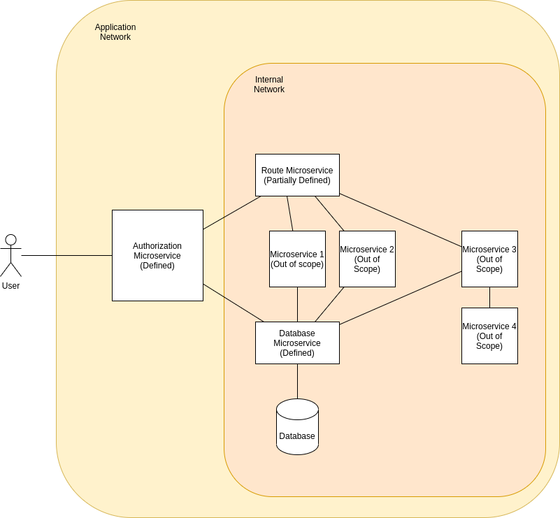

# Overall Design Goals

This team aims to create a set of microservices that are commonly used in a typical projects.
Initially, the project aims to define and implement three microservices:
- Auth microservice
- Route microservice
- Database microservice

The project will be developed for JavaScript, Python, and SpringBoot that should be interchangeable to each other.
It will also use a central devops project for CI/CD purposes. All communication between and out of microservices are encrypted with SSL

## Auth
### About
The auth service is a lone service exposed to the outside network. It serves as a single entry point to the route microservice with a limited access to database microservice for checking.

Much of the application should be controlled via `config.js` to allow flexibility to the application.
### API
- `/authenticate` GET: It issues the token. It defaults to accepting id and password information as a JSON in the body, along with timestamp and other information relevant to the security. It checks the information against appropriate database. It also have alternate authentication methods, enabled through configuration, that may use 3rd-party authentication services, such as Google, Facebook, Microsoft, etc. It does not pass the information to the Route microservice and simply responds to the request with the token.
- A catch-all API: It checks a token for authentication information. It extracts the session information from the token and compares it against appropriate database microservice. Upon approval, the request is routed to route microservice that will handle the actual routing of the request.

## Database
### About
The Database microservice handles all interaction to the database.
Certain API may be restricted to limited microservices.
### API
- `/authenticate` POST: It accepts an id and password to check the stored authentication information and responds with authorization token.
- other API to be added

## Route
### About
The Route microservice handles all routing information once the Auth microservice hands off the request.
This is only accessible from Auth microservice.
### API
- `/route` GET: It receives the request only from Auth microservice and checks token to ensure. It then checks the API request information and confirms the API exists. Then makes the appropriate request to the relevant microservice/API. If the API is not recognized, it returns 404 message.
